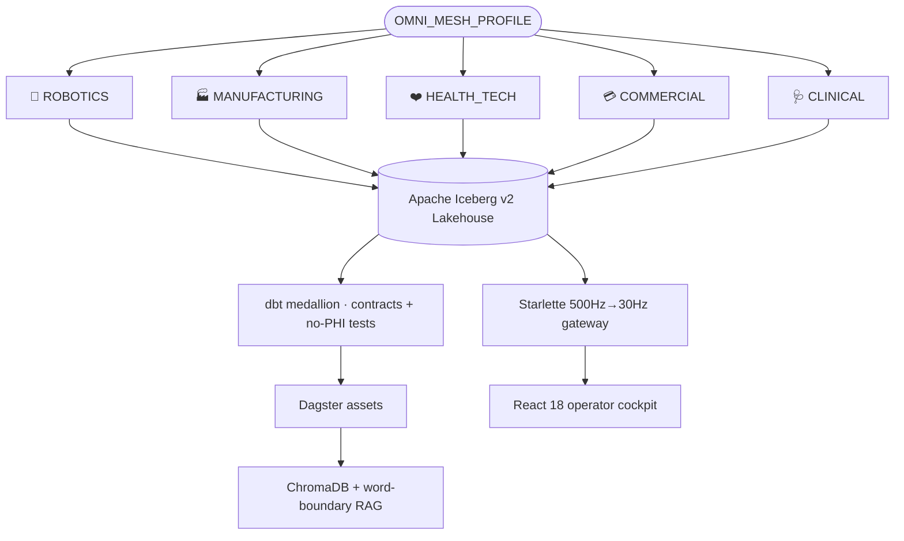

<div align="center">

# 🌐 OMNI-Mesh

### The Universal Polymorphic Cyber-Physical Data Mesh

*One codebase. Five domains. Switched by a single environment variable.*

[](https://www.python.org/)
[](https://iceberg.apache.org/)
[](https://www.getdbt.com/)
[](https://dagster.io/)
[](https://react.dev/)
[](#-testing)

</div>

---

**OMNI-Mesh** collapses three near-identical data-mesh codebases into **one polymorphic platform**. A single environment variable — `OMNI_MESH_PROFILE` — rewrites the active schema, masking targets, RAG vocabulary, and dbt model selection across the *entire* stack. Adding a new domain is **one registry entry plus one dbt model folder**.

It consolidates and supersedes the formerly separate `MFG-Mesh`, `RoboMesh`, and `heal-mesh` projects (kept read-only under [`archive/`](./archive)).

## 🧬 The five profiles

| `OMNI_MESH_PROFILE` | Domain | Bronze → Gold story |
| :--- | :--- | :--- |
| 🤖 `ROBOTICS` | VLA kinematics + video | robot signals → per-model success rates + VLA flywheel |
| 🏭 `MANUFACTURING` | OPC-UA / PLC registers | PLC readings → per-facility health & SLA breaches |
| ❤️ `HEALTH_TECH` | HIPAA wearable biometrics | wearables → de-identified per-region cohort summary |
| 💳 `COMMERCIAL` | Subscription CLV / churn | subscriptions → per-plan churn rate & lifetime value |
| 🩺 `CLINICAL` | De-identified eCRF / PHI | eCRF observations → per-study adverse-event rates |

## 🏗️ Architecture



The flow: **ingest → Iceberg → dbt medallion → Dagster → VLA flywheel → FinOps/governance → 500Hz→30Hz gateway → React cockpit** — every stage driven by the active profile.

## ✨ Highlights

- **🔁 True polymorphism** — `config/profiles.py` is the keystone: one frozen `ProfileSpec` per domain carries schema, masking targets, RAG vocab, and Chroma collection.
- **🔒 Governed medallion** — every Silver/Gold model is `contract: enforced: true`, and a custom dbt test **fails the build** if a sensitive identifier (PHI, customer id, robot serial) ever reaches a Gold table.
- **🛡️ Fail-closed security** — keyed HMAC-SHA256 masking with deterministic join-safe tokens; execution halts if the salt is missing, a known placeholder, or too short.
- **⚙️ Hardened catalog** — TOCTOU-safe Iceberg writes: the loser of a concurrent `create_table` race reloads and appends instead of crashing.
- **📉 Dual-speed streaming** — 500Hz signals downsampled to a steady 30Hz WebSocket stream; the cockpit canvas repaints off a `requestAnimationFrame` ref so high-frequency frames never trigger React re-renders.
- **🪂 Graceful degradation** — torchvision→numpy/SHA-256 and webdataset→stdlib-tarfile fallbacks mean the whole platform runs offline.

## 🚀 Quickstart

```bash
python -m venv .venv && source .venv/bin/activate
pip install -e ".[dev]"
export OMNI_MESH_MASKING_SALT="$(openssl rand -hex 24)"   # mandatory — platform fails closed without it

for P in ROBOTICS MANUFACTURING HEALTH_TECH COMMERCIAL CLINICAL; do
  export OMNI_MESH_PROFILE=$P
  omni-mesh doctor      # active config + salt status (never prints the salt)
  omni-mesh ingest      # write a Bronze Iceberg table
  omni-mesh enforce     # contract-enforced Silver + Gold medallion build
  omni-mesh index       # embed chunks into ChromaDB (downloads embedding model)
  omni-mesh ask "show EU failures"
done
```

> `index` / `ask` download a sentence-transformers model on first run (needs network).
> `doctor` / `ingest` / `enforce` work fully offline.

**Stream telemetry + drive the cockpit:**

```bash
omni-mesh gateway --port 8000                       # 500Hz→30Hz WebSocket
cd frontend_cockpit && npm install && npm run dev   # http://localhost:5173
```

**Orchestrate the whole graph:**

```bash
omni-mesh orchestrate                       # in-process Dagster run
dagster dev -m orchestration.definitions    # or the Dagster UI
```

## 📂 Repository structure

```
OMNI-Mesh/
├── config/                  # MeshProfile enum + frozen ProfileSpec REGISTRY; per-profile path isolation
├── data_platform/
│   ├── catalog.py           # TOCTOU-safe Iceberg writer (write_data_product)
│   ├── governance.py        # keyed-HMAC masking + fail-closed salt assertion + role unmask
│   ├── medallion.py         # export Bronze→parquet, dbt build, publish Silver/Gold to Iceberg
│   ├── finops.py            # per-data-product cost from dbt run_results.json
│   ├── policies.py          # profile-aware RLS/masking SQL (snowflake|databricks|bigquery)
│   ├── ai_readiness/        # ChromaDB vector store + vocab-driven \b word-boundary RAG
│   └── vla/                 # feature_extractor, shards, closed_loop (ROBOTICS flywheel)
├── dbt/
│   ├── models/<profile>/    # Silver + Gold + _schema.yml (contracts + DQ + no-PHI tests)
│   └── macros/              # no_sensitive_columns generic test
├── orchestration/           # profile-aware Dagster assets
├── streaming_gateway/       # Starlette sliding-window downsampler (500Hz → 30Hz)
├── frontend_cockpit/        # React 18 + Vite + TS + Zustand + Recharts operator cockpit
├── cli.py                   # unified `omni-mesh` Typer CLI
├── tests/                   # isolation + contract suite (conftest purges every cache)
├── archive/                 # 📦 MFG-Mesh · RoboMesh · heal-mesh (read-only predecessors)
└── OMNI-Mesh.md             # full reference architecture
```

## 🧩 Capabilities by layer

<details>
<summary><b>Phase 1–2 · Profiles, lakehouse & dbt medallion</b></summary>

| Module | Responsibility |
| --- | --- |
| `config/profiles.py` | `MeshProfile` enum + `ProfileSpec` registry (schema, masking, RAG vocab) |
| `config/settings.py` | Frozen `Settings`; per-profile path isolation under `<data_root>/<profile>/` |
| `data_platform/catalog.py` | TOCTOU-safe Iceberg writes + schema-align append |
| `dbt/models/<profile>/_schema.yml` | `contract: enforced: true` + `not_null`/`unique`/`accepted_values` tests |
| `dbt/macros/test_no_sensitive_columns.sql` | Build-breaking guard: no sensitive id reaches Gold |
| `data_platform/medallion.py` | Bronze→parquet → `dbt build` → publish Silver/Gold to Iceberg |
| `orchestration/definitions.py` | Dagster assets: `bronze_ingest → bronze_parquet → dbt_medallion → semantic_index → rag_smoke` |

</details>

<details>
<summary><b>Phase 3 · VLA flywheel, FinOps & governance policies</b></summary>

| Module | Responsibility |
| --- | --- |
| `data_platform/vla/feature_extractor.py` | CV embeddings → `gold.vla_episodes` (torchvision ResNet18, else numpy/SHA-256) |
| `data_platform/vla/shards.py` | Pre-shuffled WebDataset `.tar` shards (stdlib tarfile fallback) |
| `data_platform/vla/closed_loop.py` | Score deployed-policy inference back into `bronze.live_inference` |
| `data_platform/finops.py` | Per-data-product cost attribution from dbt `run_results.json` |
| `data_platform/policies.py` | Profile-aware RLS/masking SQL for Snowflake / Databricks / BigQuery |

ML extras are optional (`requirements-ml.txt`: torch, torchvision, webdataset, ray); everything runs without them via fallbacks.

</details>

<details>
<summary><b>Phase 4–5 · Streaming gateway & operator cockpit</b></summary>

A **Starlette** app (FastAPI's ASGI core) replays the active profile's high-frequency lakehouse signal, batches ~17 samples per frame over a sliding window, and flushes a downsampled payload at a steady 30Hz. Aggregation adapts: ROBOTICS → peak torque, MANUFACTURING → mean voltage, HEALTH_TECH → mean HRV.

The **React 18** cockpit consumes that WebSocket; panel titles, gauge labels, and accent colour re-sync from each frame's `profile`. The camera canvas animates via `requestAnimationFrame` off a ref (not React state), with a dashed predictive bounding box extrapolated by injected latency — the "dual-speed" decoupling.

> The streaming gateway + cockpit cover the three high-frequency **hardware** domains. `COMMERCIAL` and `CLINICAL` are batch domains (medallion → RAG → governance) with no live telemetry stream.

</details>

## 🧪 Testing

```bash
pytest -q       # 48 passing
```

Covers fail-closed salt handling, the Iceberg TOCTOU race-lost path, per-profile schema conformance, word-boundary RAG extraction (so `EU` never matches `revenue`), the full medallion build for all five profiles, and the no-PHI-in-Gold contract guard.

## 📦 Archive

[`archive/`](./archive) holds the three predecessor projects — `MFG-Mesh`, `RoboMesh`, `heal-mesh` — retained read-only for history and provenance. **New work happens in OMNI-Mesh.** See [`archive/README.md`](./archive/README.md) for the mapping of each old project to its OMNI-Mesh profile(s).

---

<div align="center">
<sub>📖 Full reference architecture: <a href="./OMNI-Mesh.md">OMNI-Mesh.md</a></sub>
</div>
