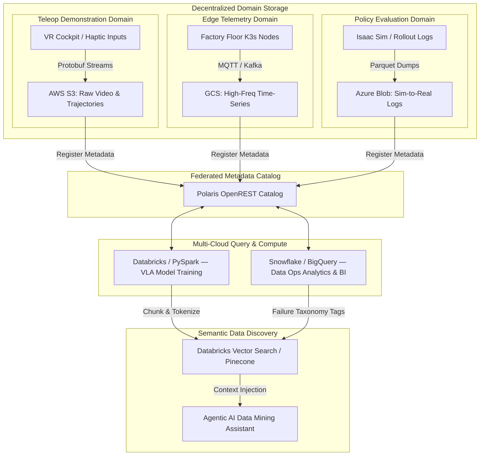
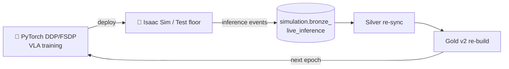

# RoboMesh — Architectural Blueprint

> The enterprise architecture document for the [RoboMesh](../README.md)
> reference implementation. Read this **first** for the *why* and the *what*;
> read [`README.md`](../README.md) for the *how-to-run*.

[](#)
[](https://iceberg.apache.org/)
[](https://docs.getdbt.com/docs/collaborate/govern/about-data-mesh)
[](https://www.databricks.com/)
[](https://dagster.io/)

> **Strategic value proposition.** RoboMesh resolves the architectural tension
> between massive, decentralized multimodal robotics ingestion and centralized,
> high-throughput machine-learning model training. By using a multi-cloud
> Apache Iceberg lakehouse, ML Research (Databricks/Spark) and Data Operations
> (Snowflake/BigQuery) can query the **same** physical files simultaneously
> without cross-cloud replication — cutting egress and storage cost while
> keeping strict schema contracts.

---

## 📑 Table of contents

- [Federated Robotics Telemetry & Demonstration Data Mesh](#federated-robotics-telemetry--demonstration-data-mesh)
- [Architectural Core Domains](#%EF%B8%8F-architectural-core-domains)
- [Multi-Cloud Domain Architecture](#%EF%B8%8F-multi-cloud-domain-architecture)
- [Core Technology Stack](#%EF%B8%8F-core-technology-stack)
- [Step-by-Step Technical Execution](#%EF%B8%8F-step-by-step-technical-execution)
  - [Phase 1 — Unified Apache Iceberg storage layer](#phase-1--unified-apache-iceberg-storage-layer)
  - [Phase 2 — Robotics Medallion architecture (dbt Mesh)](#phase-2--robotics-medallion-architecture-dbt-mesh)
  - [Phase 2.5 — VLA Feature Flywheel (PyTorch CV + Ray Data + WebDataset)](#phase-25--vla-feature-flywheel-pytorch-cv--ray-data--webdataset)
  - [Phase 3 — Federated governance & firmware-evolution controls](#phase-3--federated-governance--firmware-evolution-controls)
  - [Phase 4 — AI readiness: semantic ingestion & Agentic RAG](#phase-4--ai-readiness-semantic-ingestion--agentic-rag)
  - [Phase 5 — Pipeline orchestration & cloud FinOps optimization](#phase-5--pipeline-orchestration--cloud-finops-optimization)
  - [Phase 6 — Closed-loop policy evaluation (self-improvement flywheel)](#phase-6--closed-loop-policy-evaluation-the-self-improvement-flywheel)
- [Reference Implementation](#-reference-implementation)

---

## Federated Robotics Telemetry & Demonstration Data Mesh

```
┌──────────────────────────────────────────────────────────────────────────┐
│                               ROBOMESH                                   │
├───────────────────────────────┬──────────────────────────────────────────┤
│ DATA MESH DOMAINS             │ THE UNIFIED LAKEHOUSE                    │
│ 1. Teleop Demonstrations      │ ──► Bronze Layer: Raw JSON/MP4 Dumps     │
│ 2. Edge / Factory Telemetry   │ ──► Silver Layer: Synchronized Kinematics│
│ 3. Policy Eval & Simulation   │ ──► Gold Layer: VLA-Ready Tokens         │
├───────────────────────────────┴──────────────────────────────────────────┤
│ AI & SELF-SERVICE ANALYTICS TIER                                         │
│ ──► Frozen CV Backbone (ViT/ResNet) → Pre-computed embedding tensors     │
│ ──► WebDataset shards → Ray Data → PyTorch DDP / FSDP                    │
│ ──► Vector Indexing of Failure Taxonomy                                  │
│ ──► Agentic RAG for Researcher Data Mining                               │
│ ──► Closed-Loop Policy Eval (deployed inference → Bronze)                │
│ ──► Dagster SDA Orchestration + FinOps Cost Attribution                  │
└──────────────────────────────────────────────────────────────────────────┘
```

---

## 🏗️ Architectural Core Domains

A true data-mesh blueprint splits the robotics data landscape into three
decentralized, domain-owned data products.

### 1. Human Demonstration Domain — *the ingestion flywheel*
- **The data:** high-resolution multi-camera video, VR cockpit inputs, haptic
  controller trajectories, and operator metadata.
- **The focus:** high-throughput streaming ingestion. Captures human
  demonstrations at 50 Hz, metadata-tagged, and mapped into object storage.

### 2. Edge & Factory Telemetry Domain — *the operational muscle*
- **The data:** high-frequency joint positions, motor temperatures, torque
  values, network latency, and error states from factory-floor K3s/Docker
  deployments.
- **The focus:** time-series optimization at millions of points per second for
  operational dashboards and hardware-degradation analysis.

### 3. Policy Evaluation & Simulation Domain — *the research loop*
- **The data:** autonomous policy confidence logs, synthetic data from digital
  twins (NVIDIA Isaac Sim), and simulated path-planning trajectories.
- **The focus:** sim-to-real integration — tracking where autonomous policies
  fail versus their simulated baselines.

---

## 🏛️ Multi-Cloud Domain Architecture



---

## 🛠️ Core Technology Stack

| Layer | Production Stack | Local Reference Implementation |
| --- | --- | --- |
| **Storage tiers** | AWS S3, Google Cloud Storage, Azure Blob | Local `data/warehouse/` + MinIO (optional) |
| **Open table format** | Apache Iceberg v2 (row-level deletes) | `pyiceberg` + Iceberg v2 |
| **Catalog** | Project Polaris (OpenREST) / Unity Catalog | `pyiceberg` SQLite catalog |
| **Compute engine** | Apache Spark on Databricks | PySpark (optional) + Polars / DuckDB |
| **Warehouse** | Snowflake / BigQuery | DuckDB (Iceberg federation via `iceberg` extension) |
| **Transformation** | dbt Cloud / dbt Mesh | dbt-core + `dbt-duckdb` |
| **Orchestration** | Dagster (Software-Defined Assets) | Dagster + DagsterDaemon (local) |
| **Observability** | OpenTelemetry + Datadog | OpenTelemetry stdout exporter |
| **Vector engine** | Databricks Vector Search / Milvus | ChromaDB |
| **Embeddings** | `text-embedding-3-small` (OpenAI) | `sentence-transformers/all-MiniLM-L6-v2` |
| **CV backbone (VLA)** | Frozen ViT-B/16 on Spark/Ray GPUs | Frozen ResNet18 (torchvision) — NumPy fallback |
| **Training I/O** | Ray Data + WebDataset → PyTorch DDP/FSDP | Ray Data (optional) + `torch.IterableDataset` over WebDataset shards |
| **Tensor blob store** | S3 / GCS partitioned by `episode_id` | `data/tensors/<episode>/<key>.npy` |
| **Closed-loop sink** | Kafka → `simulation.bronze_live_inference` | Direct Iceberg append |
| **Agentic UI** | Internal LLM-powered chat | Streamlit + local LLM hook |

---

## 🗺️ Step-by-Step Technical Execution

### Phase 1 — Unified Apache Iceberg storage layer

**Objective:** establish a multi-cloud storage fabric where multiple engines
query the same dataset natively, without copying physical files across buckets.

1. **Configure cross-cloud object storage** with Parquet partitions laid out for
   Apache Iceberg.
2. **Expose via an Open Catalog.** Deploy a Project Polaris (REST) catalog and
   register the data paths in it.
3. **Mount the storage matrix.**
   - Configure **Databricks clusters** to use the Iceberg REST catalog for
     Spark operations.
   - Configure **Snowflake External Volumes** pointing at the exact same
     S3/GCS bucket locations — bypassing internal Snowflake storage.

```sql
-- Snowflake interoperable Iceberg Table over the shared bucket
CREATE OR REPLACE ICEBERG TABLE human_demonstrations_silver
  EXTERNAL_VOLUME    = 's3_robotics_data_volume'
  CATALOG            = 'polaris_mesh_catalog'
  CATALOG_TABLE_NAME = 'teleop_domain.synchronized_trajectories';
```

### Phase 2 — Robotics Medallion architecture (dbt Mesh)

**Objective:** solve the *multimodal alignment* challenge — synchronizing
high-frequency 500 Hz motor kinematics with asynchronous 30 fps camera streams
into clean, relational tables.

```
┌─────────────────────────────────────────────────────────────────────────┐
│                            MEDALLION PIPELINE                           │
├─────────────────────────────────────────────────────────────────────────┤
│  BRONZE LAYER  ──► Raw JSON kinematic logs & unaligned video S3 paths.  │
├─────────────────────────────────────────────────────────────────────────┤
│  SILVER LAYER  ──► Kinematic values time-aligned via interpolation      │
│                    and joined directly to video frame indices.          │
├─────────────────────────────────────────────────────────────────────────┤
│  GOLD LAYER    ──► Tokenized VLA feature-store matrices, partitioned    │
│                    by `robot_model_id` and `failure_type_tag`.          │
└─────────────────────────────────────────────────────────────────────────┘
```

1. **Implement data contracts.** Establish strict column and typing constraints
   at the Silver-layer boundary using dbt YAML — preventing firmware changes
   from poisoning ML training sets.
2. **Time-series synchronization (Silver).** A dbt-orchestrated PySpark step
   uses window functions to forward-fill and linearly interpolate high-frequency
   joint states, matching each to the nearest video-frame timestamp.

```yaml
# dbt_project.yml model contract definition
models:
  robomesh_teleop:
    +contract:
      enforced: true
    silver:
      +materialized: iceberg
      +schema: teleop_silver
```

### Phase 2.5 — VLA Feature Flywheel (PyTorch CV + Ray Data + WebDataset)

**Objective:** transform RoboMesh from a passive lakehouse into a closed-loop
**Vision-Language-Action** training flywheel. VLA models (OpenVLA, RT-2, π₀)
need text prompts, high-frequency frame sequences, and continuous action
tokens fused into a single stream. Letting PyTorch read raw `.mp4` from cloud
storage at train time wastes ~80 % of GPU cycles — so we **pull all
data-engineering work up into the Data Product layer**.

```
┌──────────────────────────────────────────────────────────────────────────┐
│                    VLA FEATURE FLYWHEEL (Phase 2.5)                      │
├──────────────────────────────────────────────────────────────────────────┤
│  SILVER + CV ──► Frozen ViT/ResNet runs in Spark/Ray, embeds each frame  │
│                  Heavy tensors → blob (.npy/.pt); URIs → Iceberg cols    │
├──────────────────────────────────────────────────────────────────────────┤
│  GOLD V2     ──► gold.vla_episodes_v2 = gold.vla_episodes ⨝ embedding    │
│                  summary stats (mean L2, max L2, n_frames_embedded)      │
├──────────────────────────────────────────────────────────────────────────┤
│  TRAIN I/O   ──► Ray Data + WebDataset .tar shards (≤ 256 MB, pre-       │
│                  shuffled). Streams Arrow buffers into DDP/FSDP workers. │
└──────────────────────────────────────────────────────────────────────────┘
```

#### Three pitfalls this phase explicitly addresses

| # | Pitfall | RoboMesh resolution |
| - | --- | --- |
| 1 | Storing high-dim tensors inline in Iceberg explodes Parquet files and tanks query latency. | Tabular metadata (`episode_id`, `failure_type_tag`, timestamps) stays in Iceberg. Tensors live as `.npy` blobs at `data/tensors/<episode>/*.npy`; only URIs (`tensors://…`) are columns. |
| 2 | Data lakes are sequential; neural-net training needs global random shuffling — sequential disk seeks become a bottleneck. | The Gold-tier writer materializes **pre-shuffled WebDataset shards** (`robomesh-vla-NNNNN.tar`, 50–250 MB) at materialization time. Training-time shuffling becomes per-shard only. |
| 3 | Forgetting to log how the trained model actually performs in deployment. | Phase 6 (below) streams every deployed-model inference event back into Bronze (`simulation.bronze_live_inference`) — the next training run consumes them as new failure cases. |

#### Implementation

```python
# robomesh/cv/feature_extractor.py — frozen ResNet18, eval mode, CPU/GPU
from torchvision import models
weights = models.ResNet18_Weights.DEFAULT
net = models.resnet18(weights=weights)
net.fc = torch.nn.Identity()           # → 512-d features
net.eval()
for p in net.parameters():
    p.requires_grad = False            # tensor-flow only, no gradient updates
```

```python
# robomesh/training/iterable_dataset.py — DDP-aware streaming
class RoboMeshTorchDataset(IterableDataset):
    def __iter__(self):
        shards = self._list_shards()
        info = torch.utils.data.get_worker_info()
        if info is not None:
            shards = shards[info.id :: info.num_workers]  # striped sharding
        for shard in shards:
            yield from _iter_shard_samples(shard)
```

In production this layer plugs directly into `torch.distributed.fsdp.FSDP`
without any other code changes.

### Phase 3 — Federated governance & firmware-evolution controls

**Objective:** prevent infrastructure outages when edge-hardware teams deploy
firmware that changes telemetry payload structures.

1. **Schema evolution protection.** Configure Iceberg's native schema-evolution
   properties — add/drop/rename columns gracefully without rewriting history.
2. **Schema-version safeguard.** A dbt schema verification node inside the
   ingestion orchestrator fails fast on incompatible writes.
3. **Security masking.** Cell-level masking on proprietary spatial layouts
   (factory blueprints) tokenized via SHA-256 with an enterprise salt; only
   the `SECURITY_OPERATIONS` role unmasks them dynamically.

```sql
-- Databricks Spark SQL schema-contract enforcement
ALTER TABLE teleop_silver.joint_states
  SET TBLPROPERTIES ('compatibility.append.enforce-schema' = 'true');
```

### Phase 4 — AI readiness: semantic ingestion & Agentic RAG

**Objective:** bridge classical databases and ML researchers via a
natural-language data-mining interface over petabytes of telemetry.

1. **Generate semantic metadata paragraphs.** A PySpark batch job scans
   Gold-tier episodes and translates raw sensor drops into prose:
   > *"Episode EP_9024: robot model arm Figure-01 encountered a `GRASP_FAIL`
   > event at 14:22:10 UTC. Motor joint 4 spiked to 120 Nm — exceeding the 80 Nm
   > envelope — while lifting object `target_block_03`."*
2. **Generate vector embeddings.** Chunk via LangChain text splitter, then call
   an embedding model (`text-embedding-3-small`) to produce 1536-dim vectors.
3. **Populate the vector index.** Append to **Databricks Vector Search** /
   Milvus. Each vector keeps metadata pointing back to Iceberg rows
   (`episode_id`, `robot_model_id`, `success_flag`).
4. **Agentic discovery system.** An interactive chat over the lakehouse:
   > *"Find me all teleop demonstrations where the operator recovered from a
   > joint over-torque error using the new 3-finger gripper."*
   The agent executes a vector query, identifies matching clips, and returns
   training-data URIs instantly.

### Phase 5 — Pipeline orchestration & cloud FinOps optimization

**Objective:** minimize cloud-compute costs for high-scale sensor logs and
multi-camera streams.

1. **Dagster Software-Defined Assets.** Map the data flow explicitly. Sensor
   triggers auto-execute Iceberg compaction (`OPTIMIZE`) after large ingests,
   preventing small-file fragmentation overhead.
2. **Isolate high-cost compute bottlenecks.** Open-source metadata
   instrumentation tables track query utilization performance across the stack.

```sql
-- FinOps audit: long-running, cost-inefficient ingestion tasks
SELECT
  query_id,
  user_name,
  warehouse_name,
  execution_time / 1000                     AS execution_time_seconds,
  (execution_time / 3600000.0) * 4.00       AS estimated_compute_cost_usd
FROM   snowflake.account_usage.query_history
WHERE  execution_time / 1000 > 600
  AND  query_text ILIKE '%INSERT INTO%telemetry%'
ORDER  BY execution_time_seconds DESC;
```

### Phase 6 — Closed-loop policy evaluation (the self-improvement flywheel)

**Objective:** explicitly close the loop. When a newly-trained PyTorch VLA
model is deployed to **Isaac Sim** rollouts or a **test factory floor**, every
inference confidence score and failure event streams **right back** into the
Policy Evaluation domain — seeding the next training cycle with the model's
own blind spots.



1. **Typed event payload** — `LiveInferenceEvent(inference_id, episode_id,
   model_version, ts_us, action_token_id, policy_confidence, is_failure,
   failure_type_tag, deployment_env)`.
2. **Buffered Iceberg appender** — events are buffered (default 128) then
   appended (Iceberg v2 append-only) to `simulation.bronze_live_inference`.
3. **Dagster sensor** — a downstream sensor watches the new Bronze partition
   and auto-triggers Phase 2 → 2.5 → training on threshold (e.g. 1k new
   failures observed in 24 h).
4. **Security note (workspace logging rule)** — only outcome metadata is
   logged (`policy_confidence`, `is_failure`); raw prompts and action tensors
   never appear in log streams.

```python
# robomesh/closed_loop/inference_logger.py
with InferenceLogger() as logger:
    for episode in deployment_rollouts():
        confidence, is_failure, tag = model(episode.features)
        logger.log(LiveInferenceEvent(
            episode_id=episode.id,
            model_version=ACTIVE_MODEL,
            policy_confidence=confidence,
            is_failure=is_failure,
            failure_type_tag=tag,
            deployment_env="isaac_sim",
            ...
        ))
```

---

## 📦 Reference Implementation

This repository ships a **fully runnable local reference implementation** of
every phase above. See [`../README.md`](../README.md) for the quickstart,
project layout, environment variables, testing instructions, and troubleshooting.
