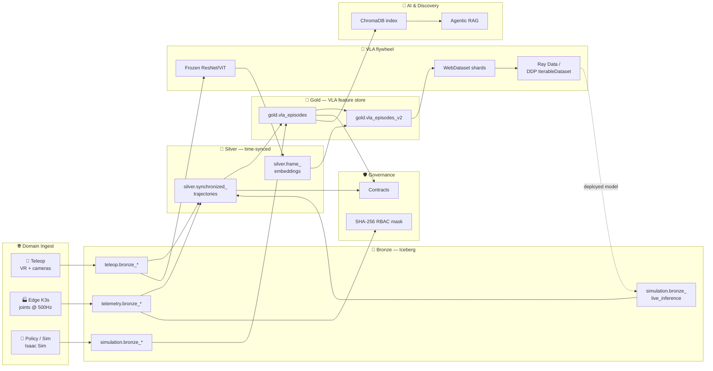

<div align="center">

> [!IMPORTANT]
> **ARCHIVED / LEGACY.** This project has been consolidated into **[OMNI-Mesh](../../OMNI-Mesh)**,
> a single polymorphic codebase that runs this domain (and the others) via the
> `OMNI_MESH_PROFILE` environment variable. The `ROBOTICS` profile in OMNI-Mesh supersedes
> RoboMesh. This repo is kept read-only for history and reference only — new work should
> happen in OMNI-Mesh.
>
> Note: a few RoboMesh assets are not yet ported to OMNI-Mesh (Ray Data / `IterableDataset`
> training I/O, the Streamlit explorer, and the walkthrough notebook). Consult this repo if
> you need them.

# 🤖 RoboMesh

### Federated Robotics Telemetry & Demonstration Data Mesh

*An end-to-end, laptop-runnable reference implementation of a multi-cloud
Apache Iceberg lakehouse for humanoid-robotics data, with a complete
**Vision-Language-Action training flywheel** and **closed-loop policy
evaluation** — built as a portfolio-grade enterprise blueprint.*

[](https://iceberg.apache.org/)
[](https://www.getdbt.com/)
[](https://dagster.io/)
[](https://pytorch.org/)
[](https://docs.ray.io/en/latest/data/data.html)
[](https://duckdb.org/)
[](https://www.trychroma.com/)
[](https://streamlit.io/)
[](https://www.python.org/)
[](#-license)

📖 **Architecture blueprint:** [`docs/RoboMesh.md`](./docs/RoboMesh.md) &nbsp;·&nbsp;
📓 **Walkthrough notebook:** [`notebooks/01_demo_walkthrough.ipynb`](./notebooks/01_demo_walkthrough.ipynb) &nbsp;·&nbsp;
🛠️ **dbt project:** [`dbt_project/`](./dbt_project/)

</div>

> **TL;DR** — `make install && make demo && make ui` ships a complete data
> mesh across **3 robotics domains**, a **medallion lakehouse on Apache
> Iceberg**, a **VLA feature flywheel** (frozen PyTorch CV → WebDataset shards
> → Ray Data / DDP), **data contracts + cell-level masking**, a **vector index
> of failure taxonomies**, an **Agentic RAG UI**, and a **closed-loop policy
> evaluator** that streams deployed-inference events back into Bronze —
> without a single cloud credential.

---

## 📑 Table of contents

- [What is RoboMesh?](#-what-is-robomesh)
- [Architecture at a glance](#%EF%B8%8F-architecture-at-a-glance)
- [Repository layout](#-repository-layout)
- [Quickstart](#-quickstart)
  - [Prerequisites](#prerequisites)
  - [Install](#install)
  - [Run the full demo](#run-the-full-demo)
  - [What `make demo` does](#what-make-demo-does)
- [Try the Agentic RAG layer](#-try-the-agentic-rag-layer)
- [Configuration & environment variables](#-configuration--environment-variables)
- [All Make targets](#%EF%B8%8F-all-make-targets)
- [Tech stack — local ↔ production](#-tech-stack--local--production)
- [Phase reference (where things live in the code)](#-phase-reference)
- [Inspecting the lakehouse](#-inspecting-the-lakehouse)
- [Testing](#-testing)
- [Security & privacy posture](#-security--privacy-posture)
- [Troubleshooting & FAQ](#-troubleshooting--faq)
- [Roadmap](#%EF%B8%8F-roadmap)
- [Contributing](#-contributing)
- [License](#-license)

---

## ✨ What is RoboMesh?

RoboMesh is the **reference implementation** of the
[architecture blueprint in `docs/RoboMesh.md`](./docs/RoboMesh.md). It models
how a humanoid-robotics company (Figure, Tesla Optimus, Apptronik, …) would
unify its three highly heterogeneous data domains:

| Domain | Data | Velocity | Iceberg namespace |
| --- | --- | --- | --- |
| 🥽 **Teleop demonstrations** | VR/haptic poses + multi-camera video | 50 Hz | `teleop.*` |
| 🏭 **Edge & factory telemetry** | Joint kinematics, motor temps, K3s health | 500 Hz | `telemetry.*` |
| 🧪 **Policy evaluation** | Isaac Sim rollouts + sim-to-real comparisons | 20 Hz | `simulation.*` |

…into **one unified Apache Iceberg lakehouse** queryable by Databricks/Spark
(training) and Snowflake/BigQuery (BI) **simultaneously**. Strict dbt-style
contracts, cell-level SHA-256 masking, vector-index discovery, and a
self-improvement closed loop are all part of the same code base.

It is a **portfolio-grade blueprint** designed to be read top-to-bottom and
run on a laptop in under two minutes.

---

## 🏛️ Architecture at a glance



> The full domain-level production architecture (Polaris REST catalog,
> multi-cloud Iceberg federation, Databricks ↔ Snowflake matrix) is in
> [`docs/RoboMesh.md`](./docs/RoboMesh.md#%EF%B8%8F-multi-cloud-domain-architecture).

---

## 📁 Repository layout

```text
RoboMesh/
├── README.md                     # ← you are here
├── docs/
│   └── RoboMesh.md               # full architectural blueprint
├── Makefile                      # one-line helpers for every phase
├── requirements.txt              # core Python deps
├── requirements-ml.txt           # optional ML extras (PyTorch + Ray + WebDataset)
├── pyproject.toml                # `pip install -e .` + `robomesh` CLI entry-point
├── .env.example                  # documented environment variables
│
├── robomesh/                     # main Python package
│   ├── config.py                 # env-driven settings (no secrets in logs)
│   ├── logging_setup.py          # structured logger (counts/IDs only)
│   ├── generators/               # Phase 0 — synthetic data per domain
│   ├── catalog/iceberg.py        # Phase 1 — pyiceberg + SQLite catalog
│   ├── ingestion/bronze.py       # Phase 1 — raw → Bronze ingest
│   ├── transformations/          # Phase 2 + 2.5 — Silver / Gold / VLA Gold v2
│   ├── cv/                       # Phase 2.5 — frozen PyTorch backbone + tensor URI store
│   ├── training/                 # Phase 2.5 — WebDataset shards + Ray Data + torch DS
│   ├── governance/               # Phase 3 — contracts + SHA-256 masking
│   ├── semantic/                 # Phase 4 — summaries → embed → ChromaDB → RAG
│   ├── orchestration/            # Phase 5 — Dagster SDAs + FinOps audit
│   ├── closed_loop/              # Phase 6 — deployed-inference → Bronze sink
│   └── cli.py                    # Typer CLI: `python -m robomesh.cli ...`
│
├── dbt_project/                  # dbt-core project (DuckDB adapter)
│   ├── dbt_project.yml
│   ├── profiles.yml
│   └── models/{silver,gold}/*.{sql,yml}   # enforced contracts
│
├── app/streamlit_app.py          # Agentic-RAG explorer UI
├── notebooks/01_demo_walkthrough.ipynb
├── tests/                        # pytest smoke + integration tests
└── data/                         # local Iceberg warehouse + tensors (gitignored)
```

---

## 🚀 Quickstart

### Prerequisites

- **Python 3.10+**
- ~500 MB free disk for the core demo  ·  ~3 GB more for the optional ML extras
- Linux / macOS / WSL2 (Windows native PowerShell is untested)

### Install

```bash
# 1. clone (or you're already here)
cd RoboMesh

# 2. create a venv and install core deps
python3 -m venv .venv && source .venv/bin/activate
make install

# 3. (optional) enable real PyTorch CV + Ray Data + WebDataset.
#    Adds ~3 GB of wheels. The demo also runs without these via a
#    deterministic NumPy fallback for the CV encoder.
make install-ml
```

### Run the full demo

```bash
make demo          # runs every phase end-to-end (≈ 1–2 min on a laptop)
make ui            # http://localhost:8501 — Agentic-RAG explorer
make dagster       # http://localhost:3000 — Dagit DAG view
```

### What `make demo` does

| Step | Command | What it produces |
| ---- | ------- | ---------------- |
| 0️⃣ **Generate** | `make generate` | Parquet drops under `data/raw/{teleop,telemetry,simulation}/` |
| 1️⃣ **Ingest** | `make ingest` | Bronze Iceberg tables (`teleop.bronze_*`, …) |
| 2️⃣ **Medallion** | `make medallion` | `silver.synchronized_trajectories` + `gold.vla_episodes` |
| 🧠 **VLA flywheel** | `make vla` + `make shards` | Frozen-ResNet `.npy` embeddings + `gold.vla_episodes_v2` + WebDataset shards |
| 3️⃣ **Governance** | `make governance` | dbt-style contract report + `governed.*` masked mirrors |
| 4️⃣ **Semantic** | `make semantic` | ChromaDB index of one prose summary per episode |
| 5️⃣ **Orchestrate** | `make orchestrate` | FinOps audit + table inventory |
| 🔁 **Closed loop** | `make closed-loop` | Live inference events → `simulation.bronze_live_inference` |

---

## 💬 Try the Agentic RAG layer

```bash
python -m robomesh.cli ask "find grasp failures on Figure-01 with a 3-finger gripper"
```

…or open the [Streamlit explorer](http://localhost:8501) and click any of the
example questions:

> *"Show me successful recoveries from joint over-torque."*
>
> *"Which episodes had the highest sim-to-real divergence?"*
>
> *"Vision occlusion failures at the Stuttgart factory."*

The agent:
1. **Parses intent** from natural language (failure tag, gripper, robot model).
2. **Queries ChromaDB** for the closest semantic matches.
3. **Re-queries Iceberg** (`gold.vla_episodes_v2`) for the matched
   `episode_id`s so you get **exact training-data pointers**, not just prose.

---

## ⚙️ Configuration & environment variables

Copy `.env.example` to `.env` to override any default. All variables are
optional — the laptop demo runs out of the box.

| Variable | Default | Purpose |
| --- | --- | --- |
| `ROBOMESH_DATA_ROOT` | `./data` | Root for the Iceberg warehouse, raw drops, tensors, and Chroma index. |
| `ROBOMESH_MASKING_SALT` | `robomesh-local-dev-salt` | HMAC salt used by Phase 3 cell-level masking. **In production this MUST come from a secret manager.** |
| `ROBOMESH_EMBEDDING_MODEL` | `sentence-transformers/all-MiniLM-L6-v2` | Sentence-transformer used by the semantic layer (Phase 4). |
| `ROBOMESH_DEMO_EPISODES` | `24` | Number of synthetic episodes the generators emit per domain. |
| `ROBOMESH_SEED` | `42` | Random seed used by every generator (for reproducible demos). |
| `ROBOMESH_ACTIVE_ROLE` | `ML_RESEARCHER` | Role consulted by the masking layer. Set to `SECURITY_OPERATIONS` to unmask. |
| `ROBOMESH_LOG_LEVEL` | `INFO` | Log level for the structured logger. |

Run `python -m robomesh.cli doctor` to print the active configuration
(no secrets are emitted — only a boolean *"salt configured: yes/no"*).

---

## 🛠️ All Make targets

| Target | Description |
| --- | --- |
| `make help` | Show every target with a one-liner. |
| `make install` | Install core Python deps + the `robomesh` package. |
| `make install-ml` | Install optional ML extras (PyTorch, torchvision, Ray, WebDataset). |
| `make demo` | **Run every phase end-to-end (0 → 6).** |
| `make generate` | Phase 0 — synthesize raw multimodal drops. |
| `make ingest` | Phase 1 — register raw drops into Iceberg. |
| `make medallion` | Phase 2 — Silver (time-sync) + Gold (VLA tokens). |
| `make vla` | Phase 2.5 — frozen-ResNet CV embeddings + `gold.vla_episodes_v2`. |
| `make shards` | Phase 2.5 — write pre-shuffled WebDataset training shards. |
| `make train-sample` | Stream a few VLA samples through Ray Data / PyTorch DDP. |
| `make governance` | Phase 3 — contracts + role-based masking. |
| `make semantic` | Phase 4 — summarize + embed + index episodes. |
| `make orchestrate` | Phase 5 — Dagster + FinOps audit. |
| `make closed-loop` | Phase 6 — stream live VLA inference back to Bronze. |
| `make dbt-run` / `make dbt-test` | Run the dbt project / dbt tests. |
| `make ui` | Launch the Streamlit Agentic-RAG explorer. |
| `make dagster` | Launch Dagit at `http://localhost:3000`. |
| `make test` | Run pytest. |
| `make clean` | Remove transient build artifacts. |
| `make nuke` | Also remove generated data, catalog, and vector index. |

---

## 🧰 Tech stack — local ↔ production

| Layer | This repo (local) | Production blueprint |
| --- | --- | --- |
| Object storage | `data/warehouse/` | AWS S3 / GCS / Azure Blob |
| Table format | **Apache Iceberg v2** (`pyiceberg`) | Apache Iceberg v2 |
| Catalog | `pyiceberg` SQLite catalog | Project Polaris / Unity Catalog |
| Compute | **DuckDB** + Polars + PyArrow | Databricks Spark + Snowflake |
| Transformations | dbt-core + DuckDB | dbt Cloud / dbt Mesh |
| Orchestration | **Dagster** local | Dagster Cloud + OpenTelemetry |
| **CV backbone (VLA)** | **Frozen ResNet18** via `torchvision` (NumPy fallback) | Frozen ViT-B/16 on Spark/Ray GPUs |
| **Tensor blob store** | `data/tensors/<episode>/*.npy` | S3 partitioned by `episode_id` |
| **Training I/O** | **`torch.IterableDataset`** + **Ray Data** + WebDataset shards | Same — connect to FSDP/DDP cluster |
| **Closed loop** | `simulation.bronze_live_inference` (Iceberg append) | Kafka → Iceberg append + Dagster sensor |
| Vector index | **ChromaDB** persistent | Databricks Vector Search / Milvus |
| Embeddings | `all-MiniLM-L6-v2` (CPU) | `text-embedding-3-small` (OpenAI) |
| Demo UI | Streamlit | Internal LLM-powered assistant |

The **same SQL** runs in DuckDB locally and Snowflake/Databricks in production —
the dbt models in [`dbt_project/`](./dbt_project/) are portable.

---

## 🗺️ Phase reference

Each phase of the [blueprint](./docs/RoboMesh.md) maps to a concrete subpackage:

| Phase | Concept | Module(s) | Key file |
| --- | --- | --- | --- |
| **0** | Synthetic data generators | `robomesh.generators` | `robomesh/generators/{teleop,telemetry,simulation}.py` |
| **1** | Iceberg catalog + Bronze ingest | `robomesh.catalog`, `robomesh.ingestion` | `robomesh/catalog/iceberg.py` |
| **2** | Medallion (Silver `ASOF JOIN`, Gold VLA) | `robomesh.transformations` | `robomesh/transformations/silver.py`, `gold.py` |
| **2.5** | PyTorch CV + WebDataset + Ray Data | `robomesh.cv`, `robomesh.training` | `robomesh/cv/feature_extractor.py`, `robomesh/training/webdataset_writer.py` |
| **3** | Contracts + SHA-256 RBAC masking | `robomesh.governance` | `robomesh/governance/contracts.py`, `masking.py` |
| **4** | Semantic summaries + Agentic RAG | `robomesh.semantic` | `robomesh/semantic/{summarizer,embeddings,vector_store,rag_agent}.py` |
| **5** | Dagster SDAs + FinOps audit | `robomesh.orchestration` | `robomesh/orchestration/{assets,definitions,finops}.py` |
| **6** | Closed-loop policy evaluation | `robomesh.closed_loop` | `robomesh/closed_loop/inference_logger.py` |

---

## 🔬 Inspecting the lakehouse

```bash
python -m robomesh.cli list             # list every Iceberg table
python -m robomesh.cli doctor           # show active config (no secrets)
python -m robomesh.cli ask "..."        # natural-language query
python -m robomesh.cli train-sample     # stream a few VLA training samples
```

You can also attach DuckDB directly to the local catalog:

```bash
duckdb data/artifacts/robomesh.duckdb \
  -c "ATTACH 'data/artifacts/iceberg_catalog.db' AS iceberg (TYPE SQLITE); \
      SELECT * FROM iceberg.sqlite_master LIMIT 20;"
```

…or browse via Dagit (`make dagster` → http://localhost:3000) to see the
DAG with the new `phase_2_5_vla` and `phase_6_closed_loop` asset groups.

---

## ✅ Testing

```bash
make test                                  # run the full pytest suite
pytest tests/test_generators.py -v         # one file
pytest tests/test_cv.py -v -k "fallback"   # CV-only, fallback path
pytest -m "not slow"                       # skip the heavier integration tests
```

What the suite covers:

- `tests/test_generators.py` — shape + cardinality of the synthetic data.
- `tests/test_pipeline.py` — full medallion (Bronze → Silver → Gold) + contracts.
- `tests/test_cv.py` — CV backbone selection, URI safety, determinism.
- `tests/test_vla_pipeline.py` — Phase 2.5 + WebDataset shard format + closed loop.
- `tests/test_rag.py` — deterministic intent parser (no model download required).

Every test runs in an isolated tmp directory via `tests/conftest.py`, so they
never touch your real `data/` warehouse.

---

## 🔐 Security & privacy posture

This codebase is shipped with the workspace-wide security rules in mind:

- **No secrets in logs.** Every logger emits counts, IDs, and outcomes only —
  never raw rows, salts, or sensitive payloads. The active masking salt is
  reported only as a boolean by `robomesh.cli doctor`.
- **HMAC-SHA-256 + enterprise salt** masks the proprietary
  `factory_blueprint_cell` column. Plaintext is unmasked **only** when
  `ROBOMESH_ACTIVE_ROLE = SECURITY_OPERATIONS`.
- **Path-traversal-safe ingest.** Bronze loader and tensor store both
  resolve every input path and reject anything outside `data/raw/` /
  `data/tensors/`.
- **dbt contract enforcement** (and the Python mirror in
  `robomesh.governance.contracts`) prevents firmware drift from corrupting
  ML training sets.
- **Closed-loop event safety.** `InferenceLogger` writes only outcome
  metadata to the Bronze table — never raw prompts or action tensors.

---

## 🩺 Troubleshooting & FAQ

<details>
<summary><strong>“<code>make demo</code> says PyTorch isn't installed — is something broken?”</strong></summary>

No. The CV layer has a deterministic NumPy fallback so the lakehouse demo
runs without any ML dependencies. Install the extras with `make install-ml`
to switch to the real ResNet18 backbone.
</details>

<details>
<summary><strong>“The first run of <code>make semantic</code> is slow.”</strong></summary>

`sentence-transformers/all-MiniLM-L6-v2` is downloaded once (~80 MB) and cached
to `~/.cache/huggingface`. Subsequent runs are instant.
</details>

<details>
<summary><strong>“Dagit shows ‘module not found: robomesh.orchestration.definitions’.”</strong></summary>

Make sure you ran `make install` (which installs the package in editable mode
via `pip install -e .`). The Dagster command relies on the import path.
</details>

<details>
<summary><strong>“I want to point this at a real S3 bucket.”</strong></summary>

Edit `robomesh/catalog/iceberg.py` and swap the SQLite catalog for any
PyIceberg-supported catalog (REST / Glue / Hive). The Bronze loader and
medallion transforms are catalog-agnostic — they only depend on the
``robomesh.catalog`` interface.
</details>

<details>
<summary><strong>“How do I reset to a clean state?”</strong></summary>

```bash
make nuke      # removes data/, dagster_home/, chroma_db/, dbt_project/target
```
</details>

<details>
<summary><strong>“Can I plug in a real LLM for the agentic answers?”</strong></summary>

Yes — see `robomesh/semantic/rag_agent.py`. The `_synthesize_answer`
function is the single integration point: swap it for any LLM call
(OpenAI, Anthropic, vLLM) and the rest of the pipeline stays unchanged.
</details>

---

## 🗺️ Roadmap

The current implementation covers every phase in the
[blueprint](./docs/RoboMesh.md). Natural next steps for an enterprise rollout:

- **PySpark backend.** Drop-in PySpark implementations of `silver.py` /
  `gold.py` / `vla.py` so the same DAG runs on Databricks at petabyte scale.
- **Polaris REST catalog.** Replace the SQLite catalog with a deployed
  Polaris instance and point both Databricks and Snowflake at it.
- **Dagster sensors.** Auto-trigger Phase 2 → 2.5 → training when
  `simulation.bronze_live_inference` accumulates new failures past a threshold.
- **OpenTelemetry export.** Wire the local stdout exporter into a real OTel
  collector for tracing across Spark / dbt / Dagster.
- **Cross-region replication.** Iceberg snapshot replication between S3 and
  GCS for disaster recovery.

---

## 🤝 Contributing

Issues and pull requests are welcome. Before opening one, please:

1. Run `make test` and ensure the suite passes.
2. Keep workspace security rules in mind — no secrets / payloads in logs,
   parameterized SQL, path-traversal-safe file I/O.
3. Update [`docs/RoboMesh.md`](./docs/RoboMesh.md) if your change crosses a
   phase boundary or introduces a new technology choice.

---

## 📄 License

Apache 2.0. See `LICENSE` (or the `pyproject.toml` metadata).

---

<div align="center">

**Built as an enterprise-grade portfolio piece for the humanoid-robotics era.**

[`docs/RoboMesh.md`](./docs/RoboMesh.md) — full architectural blueprint &nbsp;·&nbsp;
[`notebooks/`](./notebooks/) — interactive walkthrough &nbsp;·&nbsp;
[`dbt_project/`](./dbt_project/) — production-style dbt models

</div>
