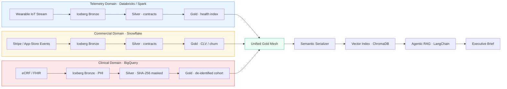

<div align="center">

> [!IMPORTANT]
> **ARCHIVED / LEGACY.** This project has been consolidated into **[OMNI-Mesh](../../OMNI-Mesh)**,
> a single polymorphic codebase that runs this domain (and the others) via the
> `OMNI_MESH_PROFILE` environment variable. The `HEALTH_TECH`, `COMMERCIAL`, and `CLINICAL`
> profiles in OMNI-Mesh supersede HEAL-Mesh. This repo is kept read-only for history and
> reference only — new work should happen in OMNI-Mesh.

# HEAL-Mesh

### Federated Wearable Health & Subscription Data Mesh

*A locally-runnable, HIPAA-aware reference implementation of the
[HEAL-Mesh architecture blueprint](./docs/architecture.md).*

`Python 3.10+`  ·  `Apache Iceberg`  ·  `dbt`  ·  `Dagster`  ·  `LangChain`  ·  `ChromaDB`

---

</div>

> A decoupled, multi-cloud data lakehouse that treats wearable telemetry,
> commercial subscription metrics, and clinical PHI as decentralized,
> interoperable **Data Products** ready for Agentic AI and self-service analytics.

This repository ships an end-to-end implementation of all five blueprint phases
that boots on a laptop in under 5 minutes and runs the full pipeline in ~70 s.

---

## Architecture at a glance



---

## Quick start — 2 commands

```bash
cp .env.example .env && make install   # one-time setup (~3 min)
make orchestrate                       # runs every phase end-to-end (~70 s)
```

Then open the Dagster UI for the interactive cross-domain DAG:

```bash
make dagster                           # http://localhost:3000
```

---

## What "make orchestrate" actually does

| Step | Phase | Artifact produced |
| ---- | ----- | ----------------- |
| 1 | Phase 1 | Synthetic wearable, Stripe, eCRF parquet drops |
| 2 | Phase 1 | Iceberg catalog + 3 bronze namespaces registered |
| 3 | Phase 1 | Cross-engine read/write proven (PyArrow → DuckDB) |
| 4 | Phase 2 | `domains/telemetry/dbt` build · contracts + tests pass |
| 5 | Phase 2 | `domains/commercial/dbt` build · contracts + tests pass |
| 6 | Phase 2&nbsp;+&nbsp;3 | `domains/clinical/dbt` build · PHI masked, no-leak test asserts |
| 7 | Phase 4 | Natural-language paragraphs joining all 3 gold tables |
| 8 | Phase 4 | Sentence-transformer embeddings written to ChromaDB |
| 9 | Phase 4 | 3 sample executive queries answered with cohort briefs |
| 10 | Phase 5 | Per-domain dbt latency + $ cost attribution table |

A reference run on a developer laptop:

```
411 patient-week narratives  ·  411 vector chunks  ·  137 unique patients
27 dbt tests passing (incl. the no-raw-PHI-in-gold singular test)
3 pytest unit tests passing
End-to-end wall-clock: ~70 seconds
```

---

## Repository layout

```
Heal-Mesh/
├── README.md                   ← you are here
├── docs/
│   └── architecture.md         ← the original design blueprint
│
├── domains/                    Phase 1 + 2 — three independent data products
│   ├── telemetry/              wearable IoT → Iceberg medallion
│   │   ├── dbt/                bronze → silver → gold + contracts + exposures
│   │   └── ingestion/          production Spark/streaming jobs (architectural slot)
│   │
│   ├── commercial/             subscription events → CLV / churn
│   │   ├── dbt/
│   │   └── ingestion/
│   │
│   └── clinical/               eCRF → SHA-256 masked PHI tables
│       ├── dbt/
│       │   ├── macros/phi_mask.sql              ← PHI masking macro
│       │   └── tests/no_raw_phi_columns_in_gold.sql
│       └── ingestion/
│
├── governance/                 Phase 3 — cross-cloud RLS / column policies
│   └── policies/
│       ├── snowflake_row_level_security.sql
│       ├── databricks_unity_catalog.sql
│       └── bigquery_column_security.sql
│
├── ai_readiness/               Phase 4 — semantic + vector + RAG
│   ├── serialization/semantic_serializer.py
│   ├── embeddings/vector_pipeline.py
│   └── rag/agentic_rag.py
│
├── orchestration/              Phase 5 — Dagster assets + OpenTelemetry
│   ├── dagster/assets/mesh_assets.py
│   └── observability/otel.py
│
├── finops/                     Phase 5 — cost-audit SQL + Grafana dashboard
│   ├── queries/snowflake_cost_audit.sql
│   ├── queries/databricks_cost_audit.sql
│   ├── dashboards/grafana_dashboard.json
│   └── run_audit.py
│
├── infrastructure/             Terraform stubs (AWS + GCP) + catalog notes
├── scripts/                    Phase-1 generators, Iceberg bootstrap, e2e runner
├── tests/                      pytest smoke tests
│
├── Makefile                    one-shot orchestration entry points
├── pyproject.toml              package metadata
├── requirements.txt            pinned dependencies
├── docker-compose.yml          optional containerized stack
└── .env.example                runtime configuration template
```

---

## Phase ↔ artifact map

<table>
<thead>
<tr><th>Phase</th><th>Blueprint objective</th><th>Where it lives</th></tr>
</thead>
<tbody>
<tr>
  <td><b>1</b></td>
  <td>Multi-cloud lakehouse on Apache Iceberg, zero data duplication</td>
  <td>
    <code>scripts/bootstrap_iceberg.py</code><br>
    <code>scripts/verify_iceberg_interop.py</code>
  </td>
</tr>
<tr>
  <td><b>2</b></td>
  <td>dbt medallion (bronze → silver → gold) with enforced YAML contracts</td>
  <td>
    <code>domains/{telemetry,commercial,clinical}/dbt/</code>
  </td>
</tr>
<tr>
  <td><b>3</b></td>
  <td>HIPAA / PHI hardening: cryptographic masking + row-level security</td>
  <td>
    <code>domains/clinical/dbt/macros/phi_mask.sql</code><br>
    <code>governance/policies/*.sql</code>
  </td>
</tr>
<tr>
  <td><b>4</b></td>
  <td>AI readiness: semantic serialization, vector store, agentic RAG</td>
  <td>
    <code>ai_readiness/serialization/</code><br>
    <code>ai_readiness/embeddings/</code><br>
    <code>ai_readiness/rag/</code>
  </td>
</tr>
<tr>
  <td><b>5</b></td>
  <td>Orchestration, observability, FinOps cost attribution</td>
  <td>
    <code>orchestration/dagster/</code><br>
    <code>orchestration/observability/otel.py</code><br>
    <code>finops/</code>
  </td>
</tr>
</tbody>
</table>

---

## Production ↔ local substitutions

This repo runs on a laptop. The table below documents the **exact swap** when
promoting it to a real cloud deployment.

| Architectural role | Production target | Local substitute used here |
| --- | --- | --- |
| Object storage | AWS S3 / GCS / ADLS | `./data/lakehouse/warehouse/` |
| Iceberg REST catalog | Polaris / Tabular / Glue / Unity | PyIceberg SQL catalog (SQLite) |
| Telemetry compute | Databricks (Spark) | PyArrow + DuckDB |
| Commercial warehouse | Snowflake | dbt-duckdb (Snowflake-shaped SQL) |
| Clinical warehouse | BigQuery | dbt-duckdb (BQ-shaped SQL + PHI masking) |
| Vector store | Databricks Vector Search / Pinecone / Milvus | ChromaDB on disk |
| Foundation model | OpenAI / VertexAI / Databricks FM API | sentence-transformers + LangChain |
| Embedding dim | 1536 | 384 (`all-MiniLM-L6-v2`, configurable via `.env`) |
| Orchestrator | Dagster Cloud | Dagster OSS (`dagster dev`) |
| Trace exporter | Datadog / Honeycomb / Tempo via OTLP | OpenTelemetry ConsoleExporter |

---

## Phase-by-phase walkthrough

### Phase 1 · Iceberg lakehouse

```bash
make seed         # 30k+ wearable rows, Stripe events, eCRF patients
make iceberg      # registers Iceberg namespaces + bronze tables
```

The verification job appends 10 000 rows in engine A (PyArrow) and reads
the new total via engine B (DuckDB) against the **same Iceberg metadata
pointers** — proving zero-copy interop.

### Phase 2 · dbt medallion

```bash
make dbt-all      # builds telemetry → commercial → clinical
```

Each domain enforces:

- `+contract: enforced: true` on every silver and gold model
- Column data types validated against the YAML contract
- `accepted_values` tests on tier/status columns
- `not_null` and `unique` tests on identity columns
- A dbt-mesh-style public exposure declaring cross-domain consumers

### Phase 3 · PHI hardening

The clinical dbt project never lets a raw PHI string leave the bronze layer:

```sql
-- domains/clinical/dbt/macros/phi_mask.sql (excerpt)

    
    
        {{ exceptions.raise_compiler_error(
            "HEAL_MESH_PHI_SALT is unset or still using the placeholder value."
        ) }}
    
    sha256(cast({{ column_name }} as varchar) || '{{ salt }}')

```

A singular dbt test (`tests/no_raw_phi_columns_in_gold.sql`) **fails the build**
if any of `mrn`, `first_name`, `last_name`, `email`, or `dob` ever appear in a
gold artifact. Production-grade Snowflake / Databricks / BigQuery policies live
under `governance/policies/`.

### Phase 4 · Agentic RAG

```bash
make embeddings   # gold metrics → narratives → vector index
make rag          # asks 3 executive-grade questions
```

Example output:

```
Q: What biological anomalies preceded membership churn risk inside the
   30-45 age demographic this month?

1. Cohort summary
   - 4 patients retrieved matching the executive query filters.
   - Sample IDs: PAT-00001, PAT-00043, PAT-00140, PAT-00194
2. Biometric anomalies observed prior to the churn event
   - Common signal: declining HRV and rising resting heart rate across
     the retrieved weeks; multiple patients in the 'moderate' or
     'elevated' sleep-risk tier in the 2 weeks prior to status change.
3. Recommended next action
   - Trigger a proactive retention outreach scoped to the patient IDs
     above, paired with a wellness check-in nudge from the clinical team.
```

The RAG agent extracts metadata filters (age bracket, region, churn-risk tier,
sleep-risk tier) from the natural-language question, applies them as ChromaDB
`$and` pre-filters, retrieves the relevant chunks, and generates the structured
brief. If `OPENAI_API_KEY` is set it calls a foundation model; otherwise it
falls back to a deterministic local responder.

### Phase 5 · Orchestration, observability, FinOps

```bash
make orchestrate-dagster   # software-defined assets DAG
make finops                # local cost-audit table
```

The Dagster assets graph mirrors the blueprint: each domain owns its assets,
and a downstream `vector_search_index` asset re-materializes whenever the
telemetry gold layer updates. Every step is wrapped in an OpenTelemetry span so
the spans show up next to dbt and Spark traces in production. FinOps queries
for Snowflake (`query_history`) and Databricks (`system.billing.usage`) ship
under `finops/queries/` ready for paste-in deployment.

---

## Security & compliance posture

| Concern | Mitigation in this repo |
| --- | --- |
| PII / PHI in logs | All loggers emit non-sensitive correlation IDs only; payloads never logged |
| Plaintext PHI on disk | Clinical bronze isolated by namespace; silver/gold only carry SHA-256 surrogates |
| Predictable hashes | `phi_mask` refuses to render if salt is unset or default |
| PHI in gold | Singular dbt test fails build if forbidden columns reach `clinical_gold` |
| Role escalation | RLS policies under `governance/policies/` default-deny by role |
| Secret leakage | `.env` is git-ignored; `.env.example` ships only placeholders |

---

## Make targets reference

| Target | What it does |
| --- | --- |
| `make install` | Create `.venv` and install all dependencies |
| `make seed` | Generate synthetic wearable / Stripe / eCRF data |
| `make iceberg` | Register Iceberg catalog + bronze tables |
| `make dbt-all` | Run dbt build across all three domains |
| `make embeddings` | Build the ChromaDB vector index |
| `make rag` | Run sample agentic-RAG queries |
| `make finops` | Print FinOps cost-attribution table |
| `make orchestrate` | One-shot end-to-end execution (~70 s) |
| `make orchestrate-dagster` | Run the Dagster end-to-end job |
| `make dagster` | Launch Dagster UI at http://localhost:3000 |
| `make test` | Run pytest unit tests |
| `make clean` | Remove generated artifacts |

---

## Troubleshooting

| Symptom | Fix |
| --- | --- |
| `HEAL_MESH_PHI_SALT is unset or still using the placeholder value` | Set a real value in `.env` (any non-empty string that doesn't start with `replace-me`) |
| `Permission denied: '/home/.../.dagster'` | `make orchestrate-dagster` redirects `DAGSTER_HOME` into the workspace; if running `dagster` manually export `DAGSTER_HOME=$(pwd)/.dagster` |
| `Permission denied: '/home/.../.cache/huggingface'` | The HF cache is auto-redirected to `data/cache/hf/`; if you run scripts outside the project export `HF_HOME=$(pwd)/data/cache/hf` |
| Dbt cannot find `dbt_project.yml` | Always run dbt from inside the domain folder (`domains/<x>/dbt`) and pass `--profiles-dir .` |

---

## License

Internal architectural reference — not for redistribution.
